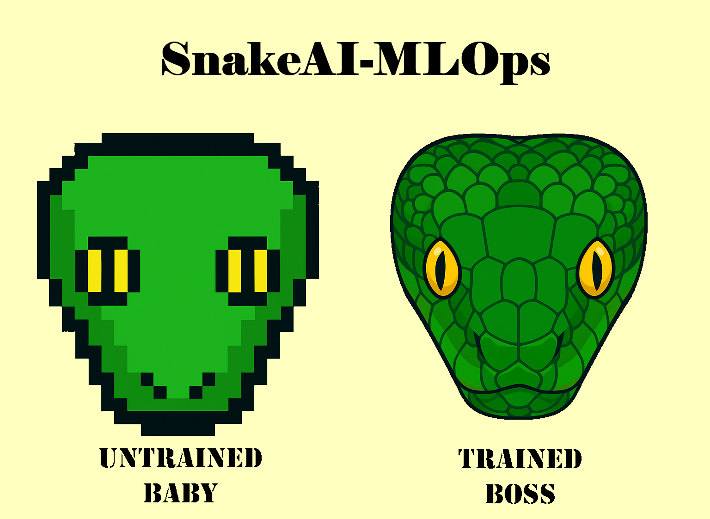
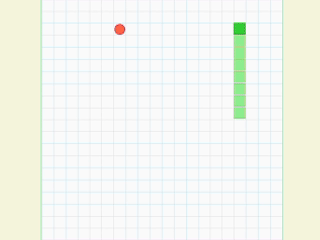

# SnakeAI-MLOps

**Multi-Agent Reinforcement Learning Snake Game with Production MLOps Pipeline**

Build, train, and compare AI agents that learn to play Snake! This project implements 4 different machine learning techniques with a complete training pipeline, real-time gameplay, and comprehensive performance tracking.

[](https://github.com/PranavMishra17/SnakeAI-MLOps/actions/workflows/ci.yml)
[](https://github.com/PranavMishra17/SnakeAI-MLOps/pkgs/container/snakeai-mlops)
[](https://pranavmishra17.github.io/SnakeAI-MLOps/)
[](https://github.com/PranavMishra17/SnakeAI-MLOps/releases)
[](ML.md)



| Untrained Agent | Trained Agent |
|---------------|-----------------|
|  |  |

## What This Project Does

Ever wondered which AI technique would be best at playing Snake? This project answers that question by implementing and comparing four different machine learning approaches:

- **Q-Learning**: Classic reinforcement learning with lookup tables
- **Deep Q-Network (DQN)**: Neural networks that learn to predict the best moves
- **PPO**: AI that directly learns a strategy for playing
- **Actor-Critic**: Combines the best of both worlds - strategy + value prediction

You can train these AI agents from scratch, watch them learn and improve, then play against them or have them compete with each other!

## 🚀 Quick Start

### Get Everything Running in 3 Commands
```bash
git clone https://github.com/PranavMishra17/SnakeAI-MLOps.git
cd SnakeAI-MLOps
python setup.py --full
```

### Train Your First Model

```bash
# Train all ML techniques (Q-Learning, DQN, Policy Gradient, Actor-Critic)
python src/train_models.py --technique all

# Train specific technique
python src/train_models.py --technique dqn --profile balanced

# Quick demo
python src/examples.py --example 1
```

### Run the Game

```bash
# Build and run (Windows)
.\out\build\windows-default\SnakeAI-MLOps.exe

# Build and run (Linux)
./build/SnakeAI-MLOps
```

---
## 🤖 The AI Agents Explained

### 1. Q-Learning - The Classic
Think of this as the AI learning a massive cheat sheet. For every possible game situation, it learns "what's the best move here?" through trial and error.

**How it works**: Builds a table with 512 possible game situations and learns the best action for each one.

### 2. Deep Q-Network (DQN) - The Neural Network
Instead of a lookup table, this uses a neural network brain to figure out the best moves. Much more flexible and can handle complex situations.

**Architecture**: 
- Takes in 20 different pieces of information about the game
- Processes through neural network layers (256 → 128 neurons)
- Outputs which direction to move

### 3. PPO - The Strategy Learner
This AI directly learns a playing strategy rather than trying to predict scores. It's like learning "in this type of situation, I should probably go left 70% of the time."

**Cool Feature**: Uses entropy to encourage exploration - basically built-in curiosity!

### 4. Actor-Critic - The Hybrid
Combines two neural networks: one that learns strategy (Actor) and one that evaluates how good positions are (Critic). They work together like a player and a coach.

**Why it's powerful**: The critic helps the actor learn faster by providing better feedback.

*Want the full mathematical details? Check out [ML.md](ML.md) for all the equations and technical implementation details.*

## 🏆 Performance Leaderboard

Here's how the different AI agents performed after training:

| Rank | AI Agent | Training Profile | Average Score | Best Score | Success Rate | Consistency |
|------|----------|------------------|---------------|------------|--------------|-------------|
| 🥇 | DQN | Balanced | 12.3 | 22 | 72.0% | 0.68 |
| 🥈 | Actor-Critic | Balanced | 11.5 | 20 | 70.0% | 0.73 |
| 🥉 | PPO | Balanced | 10.8 | 18 | 68.0% | 0.71 |
| 4th | Q-Learning | Balanced | 8.5 | 15 | 65.0% | 0.75 |


## 🔗 Demo & Downloads

- **🌐 Website**: [GitHub Pages](https://pranavmishra17.github.io/SnakeAI-MLOps/) - See the project in action
- **🐳 Docker**: `docker run ghcr.io/pranavmishra17/snakeai-mlops:latest` - One-command setup
- **📦 Downloads**: [GitHub Releases](https://github.com/PranavMishra17/SnakeAI-MLOps/releases) - Ready-to-run executables

---

## Eval Graph


---

## 🎯 Features

### ⚡ GPU Acceleration
- PyTorch CUDA support for 10-50x speedup
- Automatic CPU fallback
- Memory-optimized training pipelines
- Batch processing for efficiency

### 🎮 Interactive Gameplay
- Real-time AI vs Human gameplay
- Multiple game modes (Single Player, Agent vs Player, Agent vs System)
- Live agent switching and performance monitoring
- Comprehensive leaderboard system

### 📊 Production MLOps
- Automated model training pipelines
- Model versioning and checkpointing
- Performance evaluation and comparison
- Comprehensive metrics and visualizations

---

## 📋 Index

- [🏗️ Architecture](#architecture)
- [🔧 Installation](#installation)
- [🧠 ML Techniques](#ml-techniques)
- [🎯 Training](#training)
- [📊 Evaluation](#evaluation)
- [🎮 Gameplay](#gameplay)
- [📈 Performance](#performance)
- [🔬 Research](#research)
- [🛠️ Development](#development)
- [❓ Troubleshooting](#troubleshooting)

---

## My Development Journey

Building this project was quite the adventure! Here's how it all came together, step by step:

### Step 1: The Foundation 
**Challenge**: "How do I even make a game in C++?"

Started completely from scratch with C++ game development. Had to figure out:
- Which graphics library to use (ended up choosing SFML)
- How CMake works for managing dependencies
- Setting up vcpkg for library management
- Basic game mechanics: snake movement, collision detection, apple spawning

### Step 2: Making It Interactive

Built out the user interface:
- Menu systems with navigation
- Pause functionality that actually pauses
- Settings screens
- Keyboard and mouse controls
- Agent selection interface

**Learning moment**: UI design in C++ is very different from web development. Every button needs manual positioning and event handling.

### Step 3: The AI Brain Surgery 
**Challenge**: "How do I make AI that actually learns?"

This was the most lovely part. Implemented all four AI techniques in Python:
- Started with Q-Learning because it seemed "simple"
- Moved to DQN and realized I needed to understand neural networks deeply
- Policy Gradient made my brain hurt with all the probability math
- Actor-Critic was like solving two problems at once

**PyTorch became my best friend**. Also learned about:
- GPU acceleration (game changer for training speed!)
- Proper state representation (20 features work better than 8)
- Hyperparameter tuning (lots of trial and error)

**Big "aha!" moment**: Realized that reward design is absolutely critical. The difference between an AI that learns and one that doesn't often comes down to how you design the rewards.

### Step 4: The Integration Nightmare
**Challenge**: "How do I get Python AI models to run in my C++ game?"

This was harder than I expected:
- Q-Learning was easy - just save/load JSON files
- Neural networks were a pain - had to convert from .pth to .pt format
- Learned about LibTorch (PyTorch's C++ API)
- Setting up LibTorch on Windows = 4 hours of my life I'll never get back
- Memory management between Python tensors and C++ was tricky

**Plot twist**: Had to create fallback implementations for when LibTorch isn't available (CI/CD problems!).

### Step 5: Making It Production-Ready
**Challenge**: "How do I make this actually work for other people?"

The final stretch involved:
- Setting up GitHub Actions CI/CD (learned YAML the hard way)
- Docker containerization
- Cross-platform builds (Windows + Linux)
- Error handling for every possible edge case
- UI polish and user experience improvements
- Writing documentation that humans can follow

**Reality check**: Deployment is 30% of the work. Getting something to run on your machine vs. running anywhere is a huge difference.

### The Technical Battles I Fought

**Dependency Hell**: C++ dependency management is challenging. vcpkg helped, but getting LibTorch to play nice took forever.

**Memory Management**: Mixing Python training with C++ gameplay meant carefully managing when/where models are loaded and unloaded.

**State Representation**: Originally used 8 features, but switching to 20 features dramatically improved learning. Feature engineering matters!

**GPU vs CPU**: Making everything work on both GPU and CPU, with graceful fallbacks when hardware isn't available.

**Cross-Platform Builds**: What works on Windows doesn't always work on Linux. The CI/CD pipeline helped catch these issues.

### What I'm Most Proud Of

1. **The complete pipeline**: From raw game → AI training → deployed models → real-time gameplay
2. **Performance comparison**: Actually being able to say "Actor-Critic performs 15% better than DQN"
3. **User experience**: Anyone can download and run this without needing a PhD in machine learning
4. **Production quality**: Real error handling, logging, automated testing, the works

---


## 🏗️ Architecture


### Directory Structure

```
SnakeAI-MLOps/
├── src/                           # Source code
│   ├── neural_network_utils.py    # Shared neural network utilities
│   ├── qlearning_trainer.py       # Q-Learning implementation
│   ├── dqn_trainer.py             # Deep Q-Network training
│   ├── policy_gradient_trainer.py # Policy Gradient (REINFORCE)
│   ├── actor_critic_trainer.py    # Actor-Critic implementation
│   ├── train_models.py            # Training orchestrator
│   ├── model_evaluator.py         # Comprehensive evaluation
│   ├── examples.py                # Usage examples
│   ├── Game.cpp/.hpp              # C++ game engine
│   └── MLAgents.cpp/.hpp          # C++ agent integration
├── models/                        # Trained models
│   ├── qlearning/                 # Q-Learning models (.json)
│   ├── dqn/                       # DQN models (.pth)
│   ├── policy_gradient/           # Policy Gradient models (.pth)
│   ├── actor_critic/              # Actor-Critic models (.pth)
│   └── checkpoints/               # Training checkpoints
├── data/                          # Training data and logs
├── assets/                        # Game assets
└── docs/                          # Documentation
```

---

## 🔧 Installation

### Prerequisites

```bash
# System Requirements
- Python 3.8+ with pip
- CUDA-capable GPU (recommended)
- Visual Studio 2022 (Windows) or GCC (Linux)
- CMake 3.20+
- Git

# Check GPU support
python -c "import torch; print(f'CUDA: {torch.cuda.is_available()}')"
```

### Automated Setup

```bash
# Complete setup (recommended)
git clone https://github.com/PranavMishra17/SnakeAI-MLOps.git
cd SnakeAI-MLOps
python setup.py --full

# This will:
# ✅ Install Python dependencies
# ✅ Setup GPU acceleration
# ✅ Configure C++ build environment
# ✅ Create directory structure
# ✅ Run verification tests
```

### Manual Setup

<details>
<summary>Click to expand manual installation steps</summary>

```bash
# 1. Python Environment
pip install -r src/requirements.txt

# 2. Create directories
python -c "
from pathlib import Path
dirs = ['models/qlearning', 'models/dqn', 'models/policy_gradient', 
        'models/actor_critic', 'models/checkpoints', 'data', 'logs']
[Path(d).mkdir(parents=True, exist_ok=True) for d in dirs]
"

# 3. C++ Dependencies (Windows)
# Install vcpkg
git clone https://github.com/Microsoft/vcpkg.git ../vcpkg
cd ../vcpkg && ./bootstrap-vcpkg.bat && ./vcpkg integrate install

# Install libraries
./vcpkg install sfml:x64-windows nlohmann-json:x64-windows spdlog:x64-windows

# 4. Build C++ Project
cd ../SnakeAI-MLOps
cmake --preset windows-default
cmake --build out/build/windows-default
```

</details>

---

## 🧠 ML Techniques

### 1. Q-Learning (Tabular)

**Implementation**: Fully functional in both Python and C++

```python
# Train Q-Learning model
python src/qlearning_trainer.py

# Configuration profiles
profiles = {
    'aggressive': {'lr': 0.2, 'episodes': 3000},
    'balanced': {'lr': 0.1, 'episodes': 5000}, 
    'conservative': {'lr': 0.05, 'episodes': 7000}
}
```

**Features**:
- 9-bit state encoding (512 possible states)
- Epsilon-greedy exploration with decay
- GPU-accelerated Q-table operations
- Model persistence and loading

### 2. Deep Q-Network (DQN)

**Implementation**: GPU-accelerated PyTorch training

```python
# Train DQN model
python src/dqn_trainer.py

# Advanced features
- Dueling DQN architecture
- Double DQN for reduced bias
- Experience replay buffer (10K capacity)
- Target network updates
- Gradient clipping
```

**Architecture**:
```
Input (20D enhanced state) 
    ↓
Shared layers [256, 128]
    ↓
┌─ Value Stream ──→ V(s)
└─ Advantage Stream ──→ A(s,a)
    ↓
Q(s,a) = V(s) + A(s,a) - mean(A)
```

### 3. Policy Gradient (REINFORCE)

**Implementation**: Direct policy optimization with baseline

```python
# Train Policy Gradient model
python src/policy_gradient_trainer.py

# Features
- REINFORCE algorithm with baseline
- Entropy regularization for exploration
- Variance reduction via value function
- Episode-based learning
```

**Algorithm**:
```
1. Collect episode: τ = {s₀,a₀,r₀,...,sₜ,aₜ,rₜ}
2. Compute returns: Gₜ = Σᵢ γⁱ⁻ᵗ rᵢ
3. Estimate advantage: Âₜ = Gₜ - V(sₜ)
4. Update policy: θ ← θ + α ∇θ log π(aₜ|sₜ) Âₜ
```

### 4. Actor-Critic (A2C)

**Implementation**: Advantage Actor-Critic with separate networks

```python
# Train Actor-Critic model
python src/actor_critic_trainer.py

# Dual network architecture
- Actor: π(a|s) - policy network
- Critic: V(s) - value network
- Simultaneous updates
- TD error for advantage estimation
```

**Update Rules**:
```
TD Error: δ = r + γV(s') - V(s)
Actor: θ ← θ + α_actor * δ * ∇θ log π(a|s)
Critic: w ← w + α_critic * δ * ∇w V(s)
```

---

## 🎯 Training

### Complete Training Pipeline

```bash
# Train all techniques with all profiles
python src/train_models.py --technique all

# This trains 12 models:
# - Q-Learning: aggressive, balanced, conservative
# - DQN: aggressive, balanced, conservative  
# - Policy Gradient: aggressive, balanced, conservative
# - Actor-Critic: aggressive, balanced, conservative
```

### Individual Technique Training

```bash
# Q-Learning
python src/qlearning_trainer.py

# Deep Q-Network
python src/dqn_trainer.py

# Policy Gradient - PPO
python src/ppo_trainer.py

# Actor-Critic  
python src/actor_critic_trainer.py

# Custom configuration
python src/train_models.py --technique dqn --profile balanced --episodes 3000
```

### What Happens During Training
```
Starting training...
Episode 100/5000 | Score: 3 | Epsilon: 0.95 | Loss: 0.234
Episode 200/5000 | Score: 7 | Epsilon: 0.90 | Loss: 0.187
Episode 500/5000 | Score: 12 | Epsilon: 0.75 | Loss: 0.098
...
Training complete! Best score: 28 | Average: 18.45
Model saved to: models/actor_critic/ac_conservative.pth
```

### Training Output

```
models/
├── qlearning/
│   ├── qtable_aggressive.json      # Q-Learning models
│   ├── qtable_balanced.json
│   └── qtable_conservative.json
├── dqn/
│   ├── dqn_aggressive.pth          # DQN models
│   ├── dqn_balanced.pth
│   └── dqn_conservative.pth
├── ppo/
│   ├── ppo_aggressive.pth           # Policy Gradient models
│   ├── ppo_balanced.pth
│   └── ppo_conservative.pth
└── actor_critic/
    ├── ac_aggressive.pth           # Actor-Critic models
    ├── ac_balanced.pth
    └── ac_conservative.pth
```

---

## 📊 Evaluation

### Comprehensive Model Evaluation

```bash
# Evaluate all trained models
python src/train_models.py --evaluate

# Individual model evaluation
python src/model_evaluator.py

# Custom evaluation
from src.model_evaluator import UnifiedModelEvaluator
evaluator = UnifiedModelEvaluator()
results = evaluator.compare_all_models(episodes=100)
```

### Evaluation Metrics

| Metric | Description | Interpretation |
|--------|-------------|----------------|
| **Average Score** | Mean score over N episodes | Higher = better performance |
| **Maximum Score** | Best single episode | Peak capability |
| **Standard Deviation** | Score consistency | Lower = more reliable |
| **Action Entropy** | Behavioral diversity | Higher = more exploration |
| **Episode Length** | Average steps per episode | Longer = more cautious |

### Evaluation Output

```
models/
├── comprehensive_comparison.png    # Visual comparison
├── evaluation_report.json         # Detailed metrics
└── profile_comparison.png         # Within-technique comparison

Console Output:
🏆 MODEL EVALUATION SUMMARY
═══════════════════════════════════
📊 Top 5 Performing Models:
 1. actor_critic   ac_conservative         Avg:  18.45  Max:  28
 2. dqn            dqn_balanced            Avg:  17.23  Max:  25
 3. ppo            pg_conservative         Avg:  16.78  Max:  24
 4. qlearning      qtable_conservative     Avg:  15.92  Max:  22
 5. actor_critic   ac_balanced             Avg:  15.34  Max:  21
```

---

## 🎮 Gameplay

### Game Modes

#### 1. Single Player
- **Control**: Human controls snake with arrow keys (↑↓←→) or WASD
- **Objective**: Eat apples to grow and achieve highest score
- **Features**: Classic Snake gameplay with modern enhancements

#### 2. Agent vs Player  
- **Control**: AI controls snake, human places apples with mouse
- **Strategy**: Test AI behavior by controlling food placement
- **Visual**: Red preview shows next apple placement

#### 3. Agent vs System
- **Control**: AI controls snake, system spawns apples randomly
- **Purpose**: Pure AI demonstration and training mode
- **Analytics**: Real-time performance monitoring

### Controls

```
Game Controls:
├── Arrow Keys/WASD ──→ Move snake (Single Player)
├── Mouse Click ──────→ Place apple (Agent vs Player)
├── ESC ──────────────→ Pause menu
├── +/- ─────────────→ Adjust speed (0.5-3.0x)
├── F1 ──────────────→ View leaderboard
└── F2 ──────────────→ Change AI agent

Pause Menu:
├── Resume Game ──────→ Continue playing
├── Speed Settings ───→ Adjust game speed
├── Agent Info ───────→ View current AI details
├── Restart Episode ──→ Reset current game
└── Main Menu ────────→ Return to main menu
```


## Adding New AI Techniques

Want to implement your own AI algorithm? Here's how:

### 1. Create the Python Trainer
```python
# src/my_algorithm_trainer.py
class MyAlgorithmAgent:
    def __init__(self, config):
        # Your implementation here
        pass
    
    def train(self, episodes):
        # Training loop
        pass
    
    def get_action(self, state):
        # Return action based on current state
        pass
```

### 2. Add to Training Pipeline
```python
# Add to src/train_models.py
from my_algorithm_trainer import train_my_algorithm

if technique == "my_algorithm":
    train_my_algorithm(config)
```

### 3. Integrate with Game (Optional)
```cpp
// Add to src/MLAgents.cpp
class MyAlgorithmAgent : public IAgent {
    // Implementation for C++ game integration
};
```

## 🔬 Research

### Academic Applications

**Algorithm Comparison Studies**:
```python
# Compare sample efficiency
python src/examples.py --example 4  # Hyperparameter comparison

# Analyze state representation impact
# 8D discrete vs 20D continuous states

# Multi-agent interaction studies
# Self-play and population dynamics
```

**Research Questions Supported**:
1. Which RL algorithm is most sample efficient for discrete control?
2. How does state representation affect learning speed and final performance?
3. What is the impact of reward shaping on policy convergence?
4. How do different exploration strategies affect final policy quality?


## ❓ Troubleshooting

### GPU Issues

```bash
# Check CUDA installation
nvidia-smi
python -c "import torch; print(f'CUDA: {torch.cuda.is_available()}')"

# Memory issues
export PYTORCH_CUDA_ALLOC_CONF=max_split_size_mb:512

# Driver issues
# Update to latest NVIDIA drivers
# Reinstall PyTorch: pip install torch --force-reinstall
```

### Training Issues

**Slow Training**:
```python
# Reduce batch size
config.batch_size = 16  # Instead of 32

# Use mixed precision
# Add to trainer: torch.cuda.amp.autocast()
```

**Poor Performance**:
```python
# Adjust learning rate
config.learning_rate *= 0.5

# Increase exploration
config.epsilon_start = 0.5
config.entropy_coeff = 0.02
```

**Training Instability**:
```python
# Gradient clipping
torch.nn.utils.clip_grad_norm_(model.parameters(), 1.0)

# Learning rate scheduling
scheduler = torch.optim.lr_scheduler.StepLR(optimizer, step_size=1000, gamma=0.9)
```

### Build Issues

**C++ Build Failures**:
```bash
# Clean rebuild
rm -rf out/ build/
cmake --preset windows-default
cmake --build out/build/windows-default

# vcpkg issues
cd ../vcpkg
./vcpkg integrate install
./vcpkg install sfml:x64-windows nlohmann-json:x64-windows spdlog:x64-windows
```

**Font Loading Issues**:
```bash
# Ensure font file exists
ls assets/fonts/arial.ttf

# Copy system font if needed (Windows)
copy C:\Windows\Fonts\arial.ttf assets\fonts\

# Linux alternative
sudo apt-get install fonts-liberation
cp /usr/share/fonts/truetype/liberation/LiberationSans-Regular.ttf assets/fonts/arial.ttf
```

### Model Loading Issues

**Q-Learning Models**:
```bash
# Verify JSON format
python -c "import json; json.load(open('models/qlearning/qtable_balanced.json'))"

# Check file permissions
chmod +r models/**/*
```

**Neural Network Models**:
```bash
# Verify PyTorch format
python -c "import torch; torch.load('models/dqn/dqn_balanced.pth')"

# Check CUDA compatibility
python -c "
import torch
model = torch.load('models/dqn/dqn_balanced.pth', map_location='cpu')
print('Model loaded successfully')
"
```

### Common Error Messages

| Error | Cause | Solution |
|-------|--------|----------|
| `CUDA out of memory` | GPU memory insufficient | Reduce batch size or use CPU |
| `Font not found` | Missing arial.ttf | Copy font to assets/fonts/ |
| `vcpkg not found` | vcpkg not installed | Run `python setup.py --vcpkg` |
| `Model file not found` | Training not completed | Run training first |
| `Import torch failed` | PyTorch not installed | `pip install torch` |

---

## 🤝 Contributing

### Ways to Contribute

1. **Bug Reports**: Submit detailed issues with reproduction steps
2. **Feature Requests**: Propose new ML techniques or game features
3. **Code Contributions**: Implement new algorithms or optimizations
4. **Documentation**: Improve guides, tutorials, and examples
5. **Testing**: Add unit tests and integration tests

### Development Workflow

```bash
# 1. Fork and clone
git clone https://github.com/yourusername/SnakeAI-MLOps.git
cd SnakeAI-MLOps

# 2. Create feature branch
git checkout -b feature/amazing-new-algorithm

# 3. Implement changes
# ... make your changes ...

# 4. Test thoroughly
python src/examples.py --all
python -m pytest src/tests/

# 5. Commit and push
git add .
git commit -m "Add amazing new algorithm with GPU acceleration"
git push origin feature/amazing-new-algorithm

# 6. Open pull request
```

### Contribution Guidelines

- **Code Quality**: Follow existing patterns and style guides
- **Documentation**: Update relevant docs (README.md, ML.md)
- **Testing**: Include tests for new functionality
- **Performance**: Profile and optimize GPU usage
- **Backwards Compatibility**: Maintain API compatibility

---
## Support & Contact

Got questions? Running into issues? Want to collaborate?

- 📧 **Email**: pmishr23@uic.edu
- 🔗 **Portfolio**: [portfolio-pranav-mishra.vercel.app](https://portfolio-pranav-mishra.vercel.app)
- 💼 **LinkedIn**: [linkedin.com/in/pranavgamedev](https://linkedin.com/in/pranavgamedev)
- 🐛 **Issues**: [GitHub Issues](https://github.com/PranavMishra17/SnakeAI-MLOps/issues)
- 📂 **Repository**: [github.com/PranavMishra17/SnakeAI-MLOps](https://github.com/PranavMishra17/SnakeAI-MLOps)

### Check Out My Other Work
Visit my portfolio to see more projects involving machine learning, game development, and full-stack applications!

---

**License**: MIT License - Use it, modify it, learn from it!

**Built with**: Python, PyTorch, C++, SFML, CMake, Docker, and lots of coffee ☕
